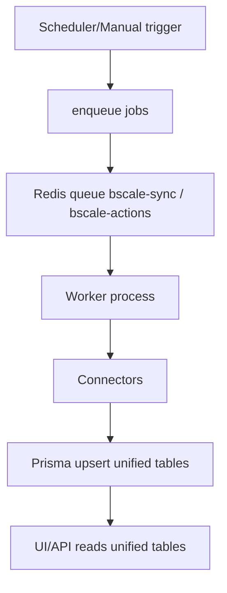

# BScale Sync Engine (adapted rollout)

## Why this engine

The sync engine moves the platform from live API fan-out in UI flows to a background-sync model:

- Cron/API enqueue jobs quickly
- Worker executes long-running jobs with retry/backoff/rate-limit behavior
- Unified data is written to Postgres (Prisma)
- UI reads from unified tables (and Redis cache), not external APIs

## Adapted architecture for current repo constraints

To keep costs and Vercel function count stable on the current plan:

1. **Hobby-safe function budget**: API routes were minimized to keep deployment under function limits.
2. **Worker-first expansion**:
   - refreshTokens + syncAccounts + syncCampaigns + syncMetrics + snapshotDaily + actions queue scaffold
3. **TikTok write/sync guarded by flag**:
   - `TIKTOK_SYNC_ENABLED=false` by default

## Job types

| Job | Purpose | Suggested schedule (UTC) |
|---|---|---|
| refreshTokens | Refresh expiring OAuth tokens | every 30 minutes |
| syncAccounts | Discover platform accounts/assets | daily or manual |
| syncCampaigns | Sync campaign structure/state | every 6 hours |
| syncMetrics | Sync daily performance metrics | hourly |
| snapshotDaily | Build daily unified snapshot row | 02:30 UTC |
| action | Queue write-back actions | on demand |

## Flow

## Runbook

1. Apply migration:
   - `npm run prisma:migrate`
2. Start app:
   - `npm run dev`
3. Start worker:
   - `npm run worker:dev`
4. Trigger queue jobs from admin/manual scripts until dedicated cron route is re-added (Pro plan or further consolidation).

## Production checklist

- [ ] `DATABASE_URL` set and migrations applied
- [ ] `CRON_SECRET` set in Vercel and worker env
- [ ] Redis configured (`REDIS_URL` or host/port/password)
- [ ] Worker process deployed (VM/container), not only Vercel serverless
- [ ] `GOOGLE_ADS_DEVELOPER_TOKEN` configured
- [ ] `TIKTOK_SYNC_ENABLED` decided explicitly
- [ ] Monitor queue failures and `SyncErrorLog`
